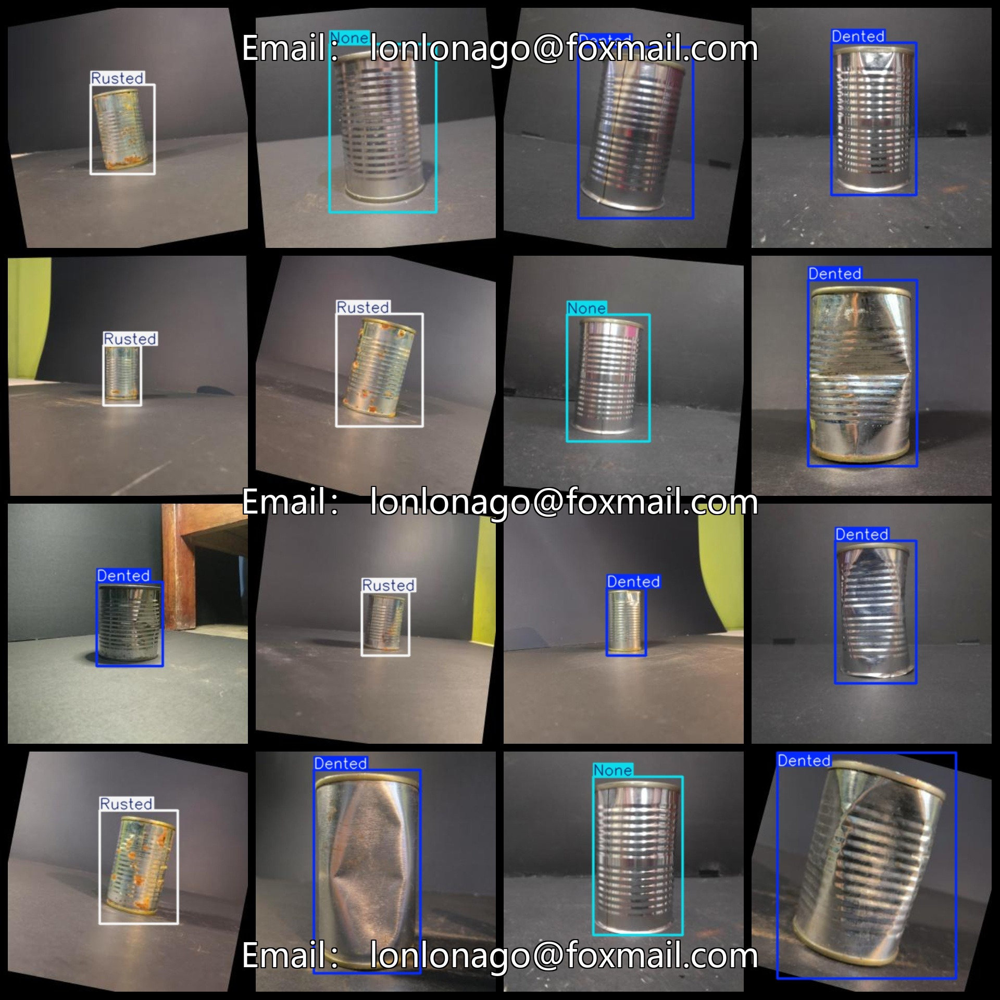
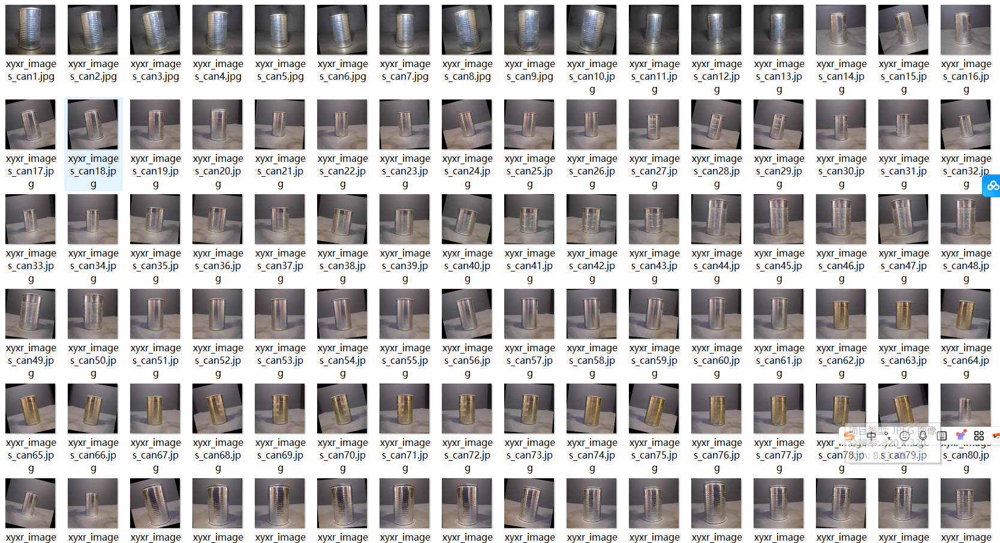

# Can Defect Dataset 6145 imagesVOC+YOLO format

The YiLaZhuang Defect Dataset contains 6145 images in the VOC+YOLO format.

The dataset is organized into three folders: JPEGImages, Annotations, and labels.

The JPEGImages folder contains a total of 6145 JPEG images.

The Annotations folder contains a total of 6145 XML files.

The labels folder contains a total of 6145 txt files.

There are a total of 3 label types: "Dented", "None", and "Rusted".

Each label type is ["Flaw","None","Rust"].

Each label type has a corresponding number of boxes (the number of boxes in the YOLO format may not correspond to this order, but is based on the classes.txt file in the Labels folder).

- Dented: 2356 boxes
- None: 1628 boxes
- Rusted: 2161 boxes

The total number of boxes is 6145.

The image resolution is clear.

The images have been enhanced.

The label shapes are rectangular boxes used for object detection recognition.

Important Notes: No guarantees are made regarding the accuracy or reasonableness of the models trained on this dataset or any associated weights files. The dataset provides accurate and reasonable annotations only.

Annotations and Image Condition:
## Images

---

Here is a pay link on Stripe (https://buy.stripe.com/3cs8yP7sY87d0vu9AB). Please contact me lonlonago@foxmail.com after funding $89, and I will send you a complete data files, thank you!

